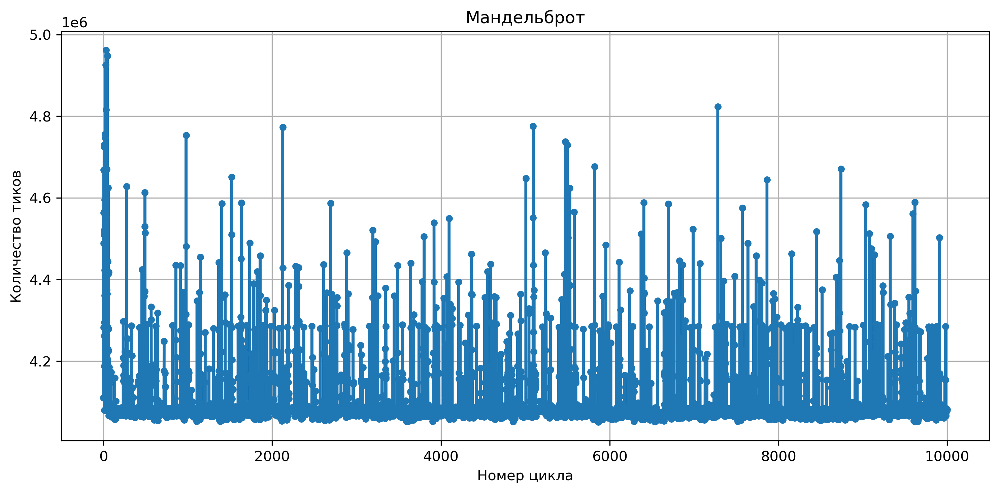

Различие версий:
```
v1 - простой вложенный цикл перебора пикселей
v2 - развертка цикла по 8 итераций
v3 - использование интринсиков и векторных регистров 
```

Методология измерений:
```c++
uint64_t start = __rdtsc();

for(size_t i = 0; i < CYCLES; i++)
{
    CalculatePixels(NULL);
}
uint64_t end = __rdtsc();

uint64_t cycles = end - start;
printf("cycles: %lu\n", cycles);
```

Параметры системы:
| Параметр | Значение |
|----------|----------|
| система | Linux Arch 6.12.77-1-MANJARO |
| CPU | Intel(R) Core(TM) i7-8550U |
| опции компилятора | -02 -march=native |
| компилятор | g++ 15.2.1 / clang 22.1.1 |
| зафиксированная частота CPU | 2.0 Ghz |


Результаты измерений:

| Параметр | v1 | v1_clang | v2 | v2_clang | v3 | v3_clang |
|----------|----|----------|----|----------|----|----------|
| количество циклов отрисовки | 10000 | 10000 | 10000 | 10000 | 10000 | 10000 |
| среднее количество тиков | 285 * 10^9 | 304 * 10^9 | 63 * 10^9 | 79 * 19^9 | 40 * 19^9 | 41 * 19^9 |
| среднее время измерений | 2m 23s | 2m 33s | 32s | 40s | 21s | 21s |


График зависимости количества тиков на один цикл от номера цикла (v3):
